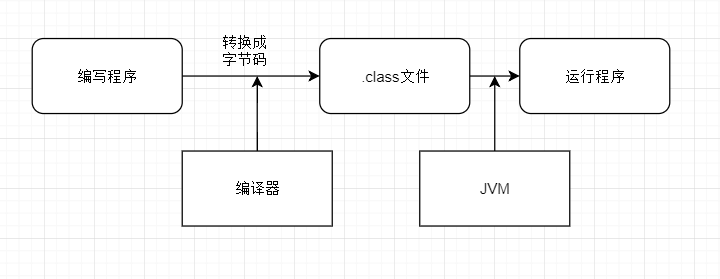
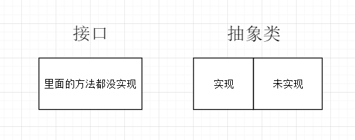
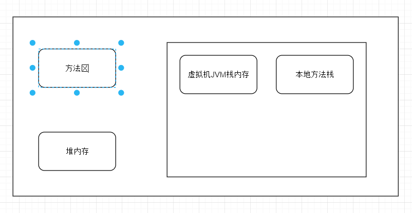

**## 0. 描述一个Java程序从编写到运行的完整过程(图文表达）

解：  

先通过编写程序，写好代码，代码通过编译器转换成字节码，就是.class文件，这个.class文件在任何设备都可以通过JVM运行出来。

**## 1. 阐述你对 Java 中 接口、抽象类、对象 的理解(图文表达 会用 UML 的尽量用 UML)**

解：Java中接口就是只有方法，但所有方法都还没实现；

抽象类就是有部分方法实现了。

 

对象就是通过类new出来的，如果说类是一个食谱，那对象就是通过那食谱做出的菜，每个对象都是不一样的。

**## 2. 举出几个常用的 git 命令，描述什么情况下会产生代码冲突？如何解决？**

解：常用的git命令：

1.cd 进入文件夹

2.mkdir 创建文件夹

3.ls -al 详细查看文件和文件夹

4.touch 创建文件

5.git clone +地址  克隆仓库

6.git add  添加文件到本地仓库

7.git push 推送到远程仓库

代码冲突：当本地仓库的文件没有更新，而远程仓库对应的文件已经更新，

在本地修改文件后，推送到远程仓库就会产生代码冲突。

解决：在本地修改代码后，先pull一下，看远程仓库文件是否有更新，若有，则选择是否保留此更新或者合并等操作，之后再push一下

**## 3. 简单描述一下 jvm 内存模型(图文表达)**

 

解：

**## 4. 编写一个单例类，要求程序能完成一定的功能(具体自定)**

解：见 文件夹 4.单例类

**## 5. 编写一个程序解决多线程问题，爸爸妈妈同时打儿子，儿子会扣血，但要求不能扣到0以下且扣血过程要准确;在此基础上尽量提高效率(具体类的设计和输出自定)**

