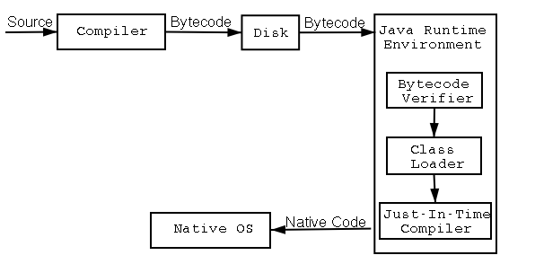

# 描述一个Java程序从编写到运行的完整过程(图文表达)

 


 第一步(编译): 创建完源文件之后，程序会先被编译为.class文件。Java编译一个类时，如果这个类所依赖的类还没有被编译，编译器就会先编译这个被依赖的类，然后引用，否则直接引用。

 第二步（运行）：java类运行的过程大概可分为两个过程：1、类的加载  2、类的执行。需要说明的是：JVM主要在程序第一次主动使用类的时候，才会去加载该类。也就是，JVM并不是在一开始就把一个程序就所有的类都加载到内存中，而是到不得不用的时候才把它加载进来，而且只加载一次。

例如以前写的代码：

```java
public class MainApp {  
    public static void main(String[] args) {  
        Animal animal = new Animal("Puppy");  
        animal.printName();  
    }  
}  
//Animal.java  
public class Animal {  
    public String name;  
    public Animal(String name) {  
        this.name = name;  
    }  
    public void printName() {  
        System.out.println("Animal ["+name+"]");  
    }  
}  
```

1. 在编译好java程序得到MainApp.class文件后，在命令行上敲java AppMain。系统就会启动一个jvm进程，jvm进程从classpath路径中找到一个名为AppMain.class的二进制文件，将MainApp的类信息加载到运行时数据区的方法区内，这个过程叫做MainApp类的加载。
2. 然后JVM找到AppMain的主函数入口，开始执行main函数。
3. main函数的第一条命令是Animal  animal = new Animal("Puppy");就是让JVM创建一个Animal对象，但是这时候方法区中没有Animal类的信息，所以JVM马上加载Animal类，把Animal类的类型信息放到方法区中。
4. 加载完Animal类之后，Java虚拟机做的第一件事情就是在堆区中为一个新的Animal实例分配内存, 然后调用构造函数初始化Animal实例，这个Animal实例持有着指向方法区的Animal类的类型信息（其中包含有方法表，java动态绑定的底层实现）的引用。
5. 当使用animal.printName()的时候，JVM根据animal引用找到Animal对象，然后根据Animal对象持有的引用定位到方法区中Animal类的类型信息的方法表，获得printName()函数的字节码的地址。
6. 开始运行printName()函数。

